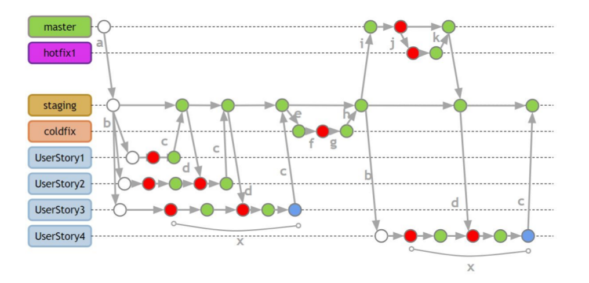

# Panduan Alur Kontribusi & Pengembangan

**Proyek Perangkat Lunak @ Fakultas Ilmu Komputer Universitas Indonesia, Semester Genap 2018/2019**

### *Setup environment* untuk Project

------

Sebelum pengerjaan *user story* dilakukan, **wajib** mengecek kesiapan *environment* dari tools yang akan digunakan.

**Aplikasi yang sebaiknya diinstal (untuk memudahkan proses *development*)**

1. Android Studio/IntelliJ
2. Visual Studio Code/PyCharm
3. Postman
4. Typora (untuk mengedit README.md)

**Setup environment Flutter**

1. Pastikan anda telah menginstal Flutter dan berbagai *dependency* nya (Android Studio/Visual Studio Code, Android SDK, dan Android Emulator/Device Android). Ingat, gunakan **Flutter 1.0** dengan **Dart 2**.

2. Baik di Android Studio maupun Visual Studio Code, pastikan anda telah menginstal **Flutter Plugin** dan **Dart Code Support**.

3. Cek instalasi Flutter anda dengan menjalankan:
  ```bash
  $ flutter doctor -v
  ```

  Selanjutnya akan ditampilkan berbagai informasi tentang instalasi Flutter dan tools pendukungnya, hingga *device* yang sedang terhubung ke komputer anda. pastikan semuanya diberikan tanda centang.

4. Selanjutnya, lakukan instalasi **adb**. adb digunakan oleh Flutter untuk mendeteksi *device* Android anda dalam modus **USB debugging**, jika anda ingin menjalankan aplikasi di perangkat anda.

   ```bash
   $ sudo apt-get install adb
   $ adb devices #mengecek ketersediaan device anda
   ```

5. Masuk ke dalam *root folder* project anda, instal *dependencies* yang dimiliki oleh aplikasi anda dengan menjalankan:

   ```bash
   $ cd [PATH_KE_PROJECT_ANDA]
   $ flutter packages get
   ```

6. Jika anda ingin meng-upgrade semua *dependencies* yang dimiliki oleh aplikasi anda, jalankan:

   ```bash
   $ flutter packages upgrade
   ```

**Setup environment Django**

1. Pastikan anda telah menginstal **Python 3.6** dan **pip**.

2. Masuk ke folder root dari django anda, dan install **virtualenv**.

   ```bash
   $ cd [PATH_KE_PROJECT_ANDA]/scrum-booster-api/
   $ sudo pip install virtualenv
   ```

3. Buatlah environment baru. Pastikan environment dibuat **diluar *root folder* dari project django, dan memiliki prefiks** **env-*** (mis. env-scrumbooster).

   ```bash
   $ virtualenv -p /usr/bin/python3.6 -v env-scrumbooster
   ```

4. Aktifkan environment yang telah anda buat, dan instal semua *requirements* yang dibutuhkan.

   ```bash
   $ source ../[nama-env-anda]/bin/activate
   $ pip install -r requirements.txt
   ```

### Panduan Git Flow dalam Proses *Development*

------

Sesuai [Panduan Git PPL 2019](https://drive.google.com/drive/u/1/folders/1csqRIfpKdnkwByvJL5aeRdlvxFnKBzJb), Git Flow yang digunakan adalah kombinasi dari standar industri dan kemudahan pelaksanaan perkuliahan.

**NOTE: Harap ikuti konfigurasi berikut. Akan berpengaruh terhadap penilaian PPL.**

Berikut adalah ilustrasi Git Flow dan keterangannya yang disesuaikan dengan konteks kuliah PPL 2019:



Pada Git Flow PPL 2019 terdapat beberapa cabang (branch), yaitu:

1. Branch `master`: Branch utama yang menyimpan kode yang sudah siap di-*deploy* ke dalam *production environment*. Kode yang tersimpan dalam branch ini sudah siap digunakan oleh *user*.

2. Branch `staging`: Branch yang terkait dengan proses pengembangan. Branch ini akan menyimpan *source code* hasil pekerjaan dari setiap developer yang dikumpulkan di satu tempat. Aplikasi yang akan dipergunakan pada saat *sprint review* berasal dari branch ini.

3. Branch `user story`: Branch yang digunakan untuk *implementasi* sebuah *user story* (PBI). Nantinya, akan ada beberapa cabang *user story* yang diberi nama sesuai dengan nama *user story* yang dikembangkan. Branch ini merupakan percabangan dari branch `staging`.  Pada saat akan digabungkan, *code reviewer* dari branch *user story* adalah teman satu tim yang bukan penanggung jawab dari *user story* tersebut. **Lakukan commit squash saat melakukan merge request**.

   **Format penamaan branch:** `US-<nomor_user_story>-<judul_user_story>`

   Contoh: `US-1-Sebagai_user_saya_ingin_melakukan_login`

4. Branch `hotfix`: Percabangan dari branch `master` yang dibuat apabila terdapat *bug* pada kode di branch `master`. Branch ini digunakan sebagai tempat untuk memperbaiki *bug* tersebut. Selanjutnya, branch ini akan kembali di-*merge* ke branch `master`.

5. Branch `coldfix`: Branch yang dibuat untuk melakukan *rollback* (menghapus semua perubahan dari branch *user story*) apabila dalam sprint review terjadi penolakan salah satu *user story* oleh Product Owner. Branch ini nantinya akan ditarik dari branch `staging`, dan perbaikannya akan kembali di-*merge* ke branch `staging`.

   **Format penamaan branch:** `coldfix-sprint_<nomor_sprint>`

   Contoh: `coldfix-sprint_1`

**Konvensi penamaan commit**

Ada 3 *tag* yang akan digunakan dalam penamaan *commit* dalam Git Flow kali ini.

1. **[RED]**: Commit yang bersifat menginisiasi kode *unit test* dari suatu aplikasi (fungsi/class kosong). Ditandai dengan **silang merah** pada hasil *pipeline test* GitLab.

   Contoh commit message: `[RED] membuat test_login_admin`

2. **[GREEN]**: Commit yang bersifat mengimplementasikan *unit test* pada aplikasi. Ditandai dengan **centang hijau** pada hasil *pipeline test* GitLab.

   Contoh commit message: `[GREEN] membuat fungsi login_for_admin`

3. **[REFACTOR]**: Commit yang bersifat mengubah susunan kode *unit test* pada aplikasi, dengan tidak mengubah status dari *pipeline test* Gitlab. (tetap sukses).

   Contoh commit message: `[REFACTOR] restructure fungsi login_for_admin`

4. **[CHORES]**: Commit yang berisikan implementasi yang tidak berhubungan langsung dengan fungsionalitas aplikasi (ex. penambahan *asset* berupa image tanpa mengubah implementasi kode). Tidak ada peraturan khusus mengenai *pipeline status* Gitlab.

   Contoh commit message: `[CHORES] restructure perintah pada berkas .gitlab-ci.yml`

Pada saat pengimplementasian dari *user story*, gunakan commit yang **ringkas dan mudah dimengerti.**

